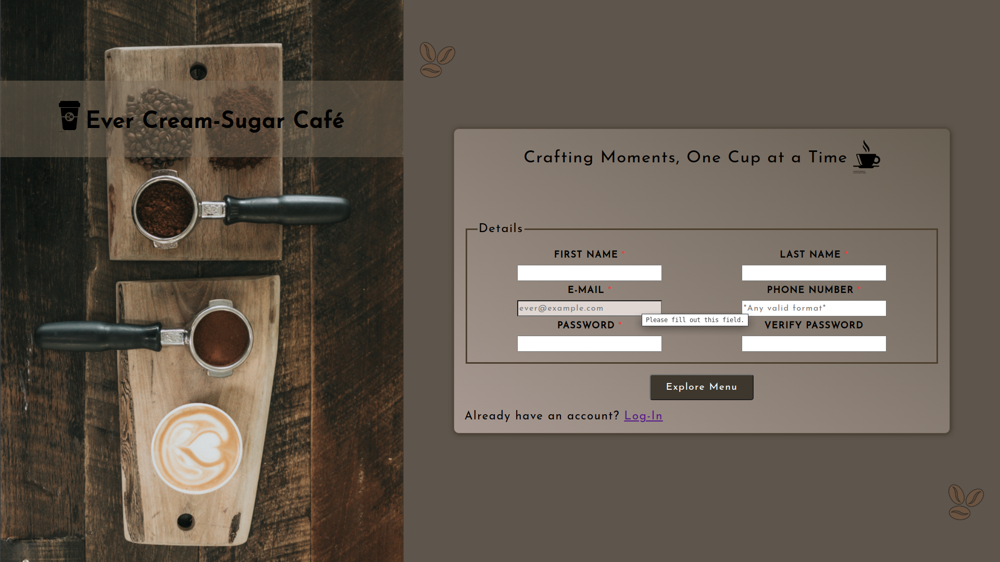
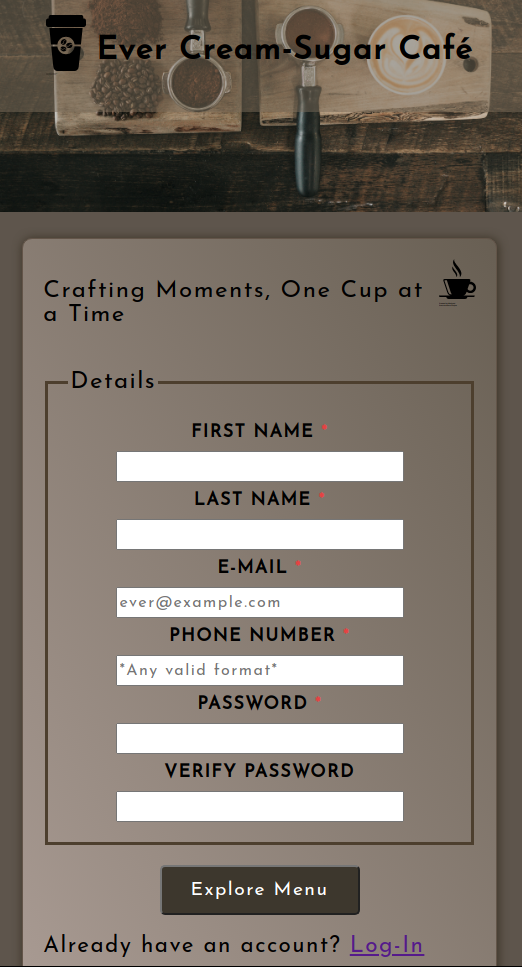

# Sign-up Form

    <h3>💻 Languages</h3>
    
    
    
    <h3>🔧 Technologies</h3>
    
    
    
    <h4><a href="https://asdacosta.github.io/sign-up-form/">Live Preview</a></h4>

**Demo:**

**
Screen views
**

**Desktop View:**

 

**Mobile View:**

## 🌐 Origin
[The Odin Project](https://www.theodinproject.com/)

## 📝 Description
Builds a sign up form with validation.

## 🎯 Relevance
To solidify concepts of `Forms` in HTML. 

## 👥 Intended Audience
Developers, users, recruiters.

## 📂 Files

Invert

| File | Description |
| - | - |
| `index.html` | Structure of web page.|
| `sign.js` | Adds interactivity to form.|
| `style.css` | Style form to be visually appealing.|
|`imgs/*`|The images used in the website.|
|`view-imgs/*`| Live demo and different screen views used in `README.md`.|

## ©️ Credit

Invert

| File | Credence |
| - | - |
| `imgs/bg.png` | By Nathan Dumlao from [Unsplash](https://unsplash.com/).|
| `imgs/cup.svg` | By Yasminvisible from [Noun Project](https://thenounproject.com/icon/coffee-1206478/) .|
| `imgs/mug.svg` | By Marlyani from [Noun Project](https://thenounproject.com/icon/coffee-3466441/).|
| `imgs/coffee-beans.png` | [Flaticon](https://www.flaticon.com/free-icons/coffee-beans).|

## 🔄 Improvements

Invert

- [ ] Decease size of background image to improve load performance.

## 👤 Contributor & Curator
1. [Abraham Da Costa Silvanus](https://github.com/asdacosta) 

 

> [!IMPORTANT]
> Seek contributor's consent for any code usage.

**[🞁 Top](#sign-up-form)**